# Lab 1

## Q.1
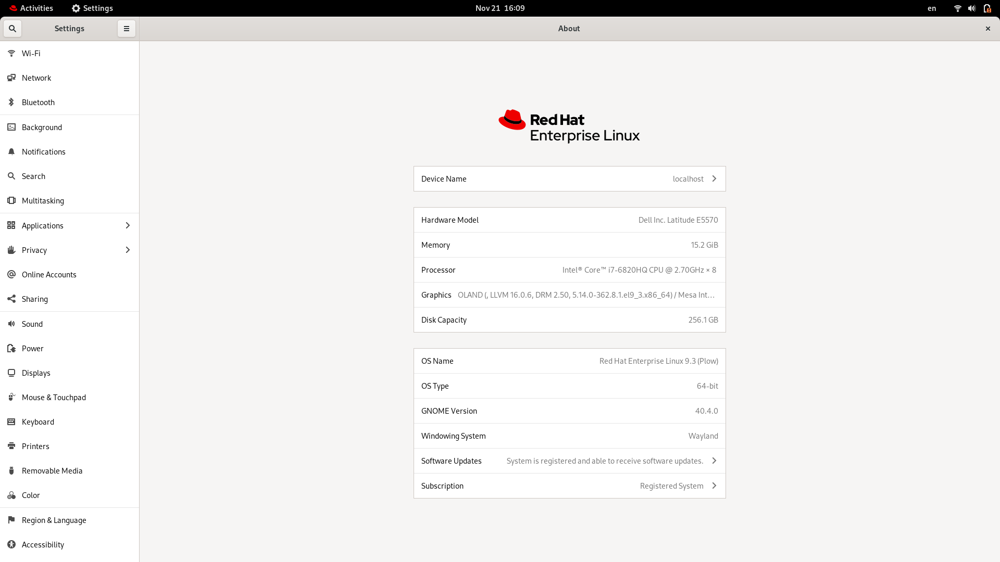

## Q.2 cat vs. more?
### cat

prints the output of a test file to the standard output stream and exists.

### more

Divides the content of the test files into pages that allows you to read through them and can perform a search operation.

## Q.3 rm vs. rmdir?

### rmdir

Can only delete empty folders

### rm
Can delete files and folders whether empty or not if you added `-r` option to it

## Q.4
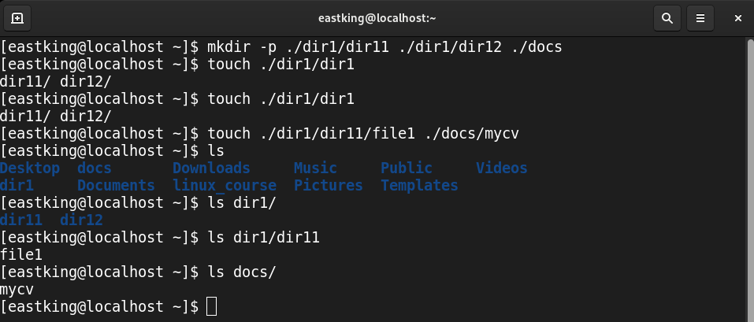

### A
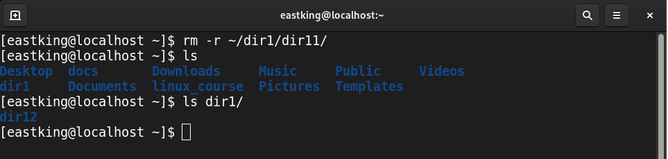

### B
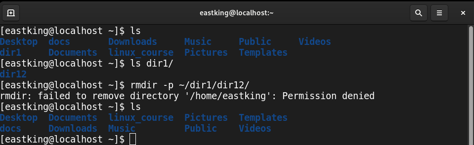

### C

**Absolute Path** : `/home/user/docs/mycv`

**Relative Path** : `./docs/mycv`

## Q.5
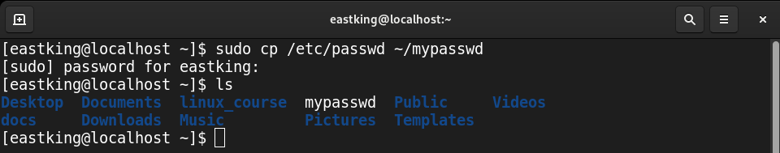

## Q.6
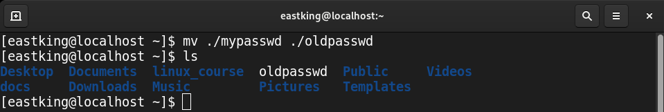

## Q.7

1. `cd`

1. `cd ~`

1. `cd /home/username`

1. `cd ../../home/username`

## Q.8

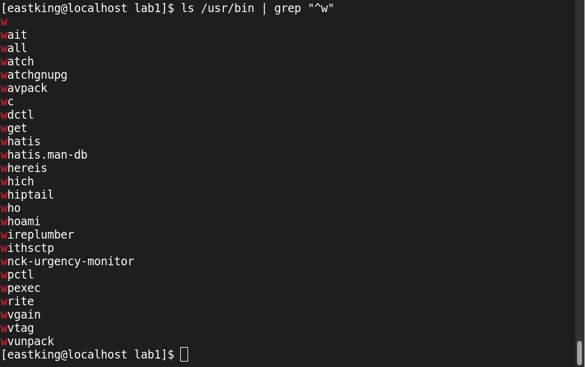

## Q.9

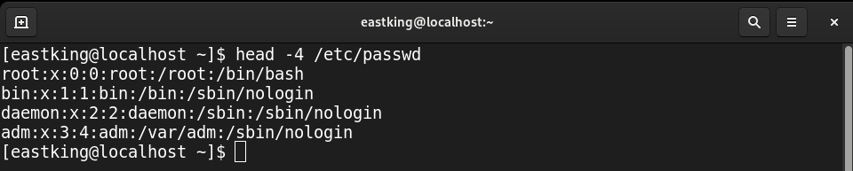

## Q.10

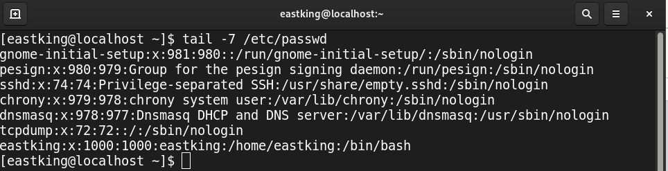

## Q.11

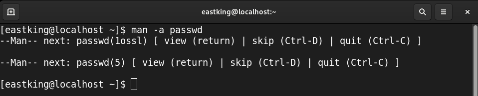

## Q.12

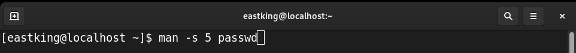
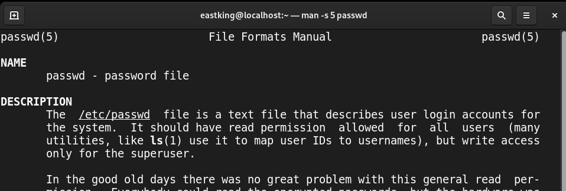

## Q.13

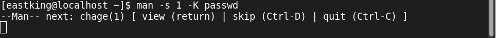
