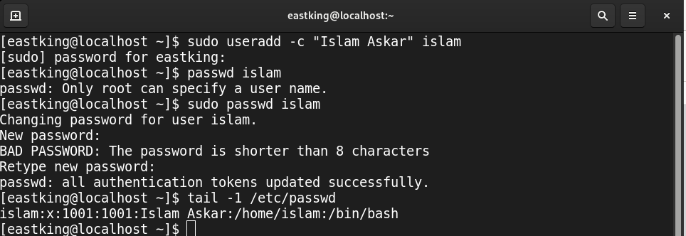
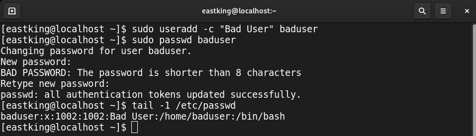
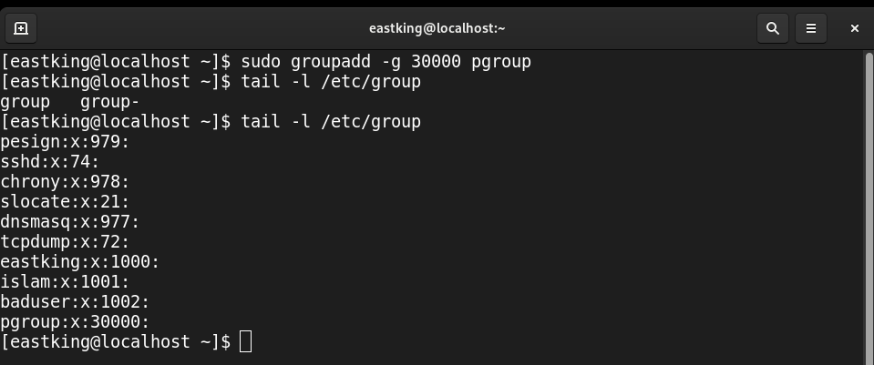
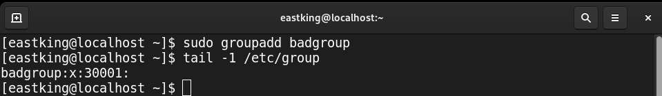
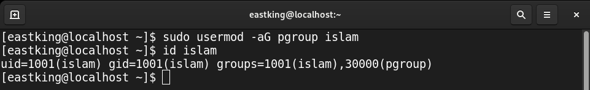
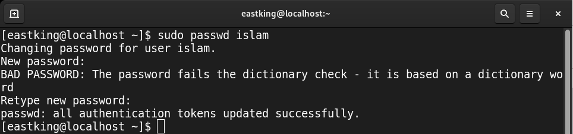
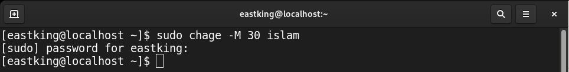
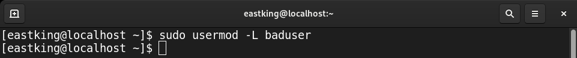
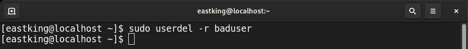
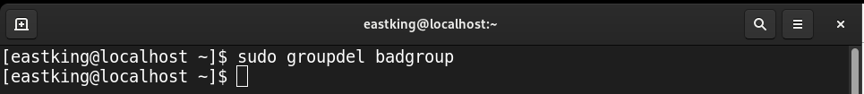

# Lab 2

## Q.1: Create user account *islam*? 

## Q.2: Create user account *baduser*?

## Q.3: Create secondary group "*pgroup*" with *gid* 30000?

## Q.4: Create secondary group "*badgroup*"?

## Q.5: Add *islam* to "*pgroup*"?

## Q.6: Modify *islam*'s password to "*password*"?

## Q.7: Modify *islam*'s password to expires in 30 days?

## Q.8: Lock "*baduser*" account?

## Q.9: Delete "*baduser*" accound?

## Q.10: Delete supplementary group "*badgroup*"?

