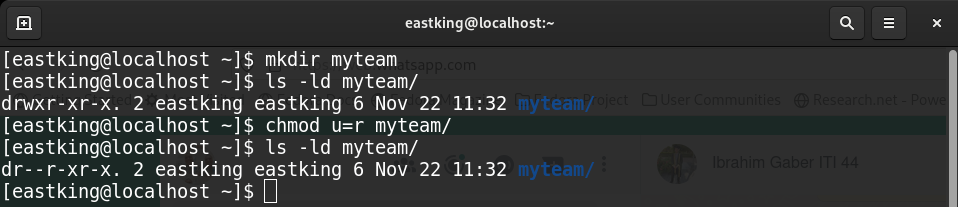
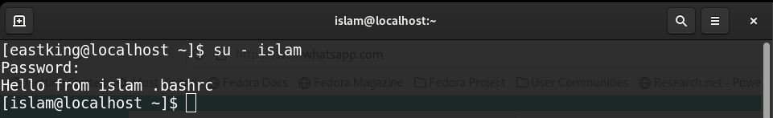
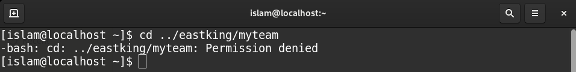
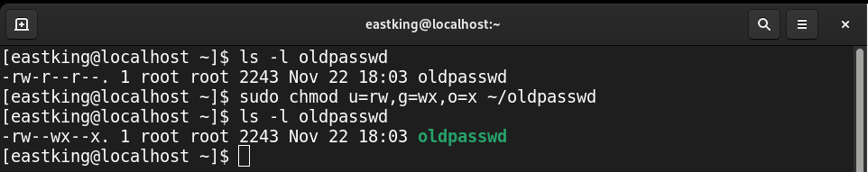
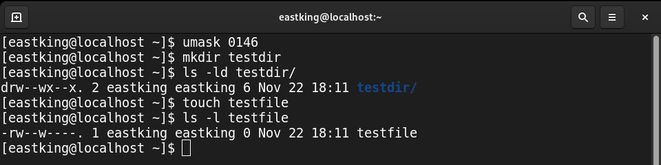
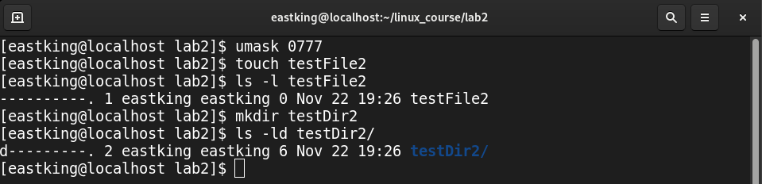
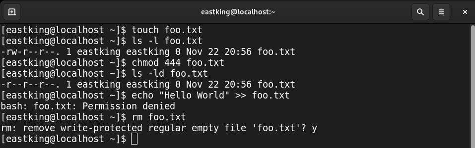

# Lab 2

## Q.1: Create user account *islam*? 

## Q.2: Create user account *baduser*?

## Q.3: Create secondary group "*pgroup*" with *gid* 30000?

## Q.4: Create secondary group "*badgroup*"?

## Q.5: Add *islam* to "*pgroup*"?

## Q.6: Modify *islam*'s password to "*password*"?

M
## Q.7: Modify *islam*'s password to expires in 30 days?

## Q.8: Lock "*baduser*" account?

## Q.9: Delete "*baduser*" account?

## Q.10: Delete supplementary group "*badgroup*"?

## Q.11: Create folder *myteam* and change permission to read only for owner?

## Q.12: Log out and log in by another user?

## Q.13: Try to access (by *cd* command) folder *myteam* ?

## Q.14

1. Change *oldpasswd* file permissions to u=rw,g=wx,o=x
		 

1. Change your default permissions to be as above
	 

1. What is the max permission a file and a directory can have by default?
	* **File** : 666
	* **Directory** : 777

1. Change default permission to be no permission for everyone?
	

## Q.15: What are the minimum permisson needed for?

1. Copy a directory

	|min permissions needed for	|Source Dir|Dest Dir |
	|---------------------------|----------|---------|
	|Copy Dir                   | r        | w,x     |

1. Copy a file

	|min permissions needed for	    |Source File|Dest Dir|
	|-------------------------------|-----------|---------|
	|Copy File                      | r         | w,x     |

1. Delete a file

    |min permissions needed for	    |Source File|Parent Dir|
	|-------------------------------|-----------|----------|
	|Delete File                    |      _    | w,x      |

1. Change to a directory

    |min permissions needed for	    |Target Directory|
	|-------------------------------|----------------|
	|Change into Directory          |x               |

1. List a directory content

    |min permissions needed for	    |Target Directory|
	|-------------------------------|----------------|
	|List Directory Content         |r               |

1. View a file content

    |min permissions needed for	    |Target File|
	|-------------------------------|-----------|
	|View File Content              |r          |

1. Modify a file

    |min permissions needed for	    |Target File|
	|-------------------------------|-----------|
	|Modify File                    |w          |

## Q.16: Create a file with permission 444? try edit && remove it?

## Q.17: What is the difference between ***x*** permission for a file and a directory?

|permission|File                          |Directory                         |
|----------|------------------------------|----------------------------------|
|**X**     |Can run the file as executable (e.g bash scripts, python scripts, linux executables,...)|Can access the directory     |
