# Lab 3

## Q.1: Write CV using vi?

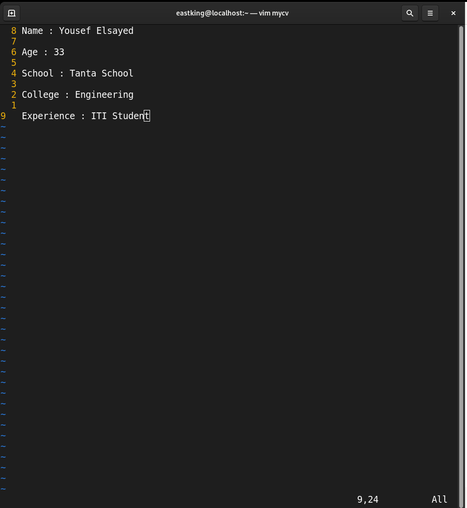

## Q.2

|Description                                               |Command       |
|----------------------------------------------------------|--------------|
|Move cursor down one line at time                         |`j`           |
|Move cursor up one line at time                           |`k`           |
|Search for work age                                       |`/age`        |
|Step to line 5                                            |`:5` or `5G`  |
|Delete the line you are on                                |`dd`          |
|Delete the line number 5                                  |`:5d`         |
|Step to end of line and change to writing mode in one step| `A`          |

## Q.3: List available shells in your system

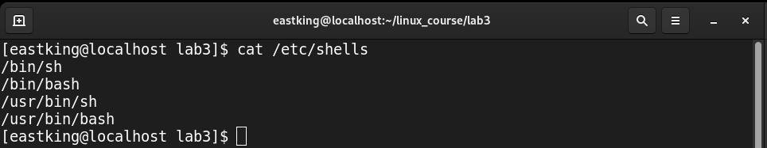

## Q.4: List environment variables in your current shell?

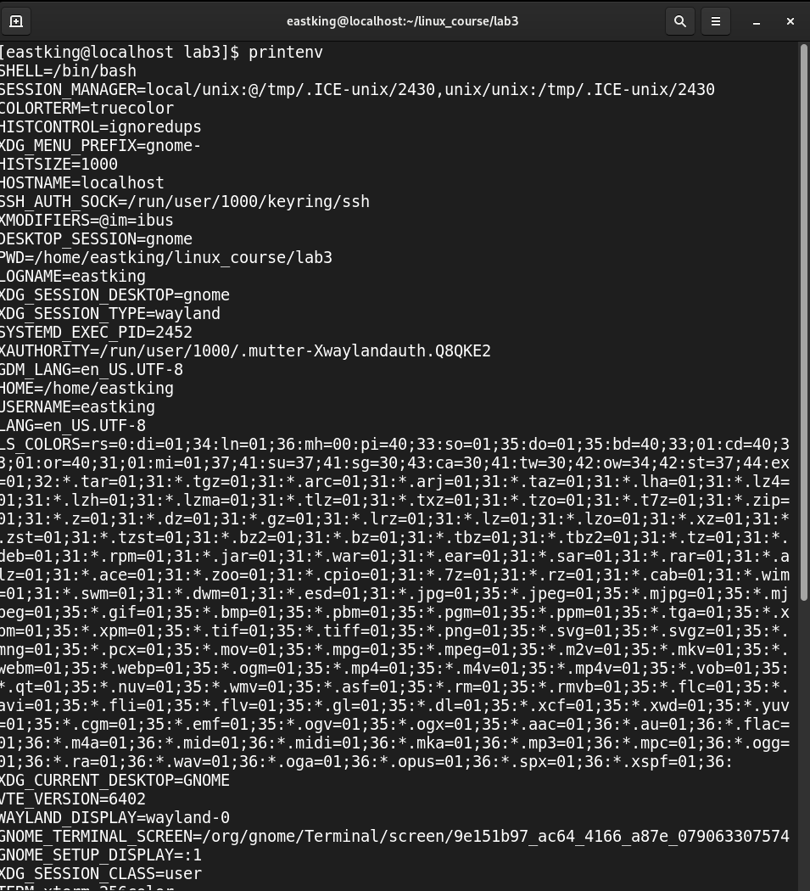

## Q.5: List all environemnt variables for the bash shell?

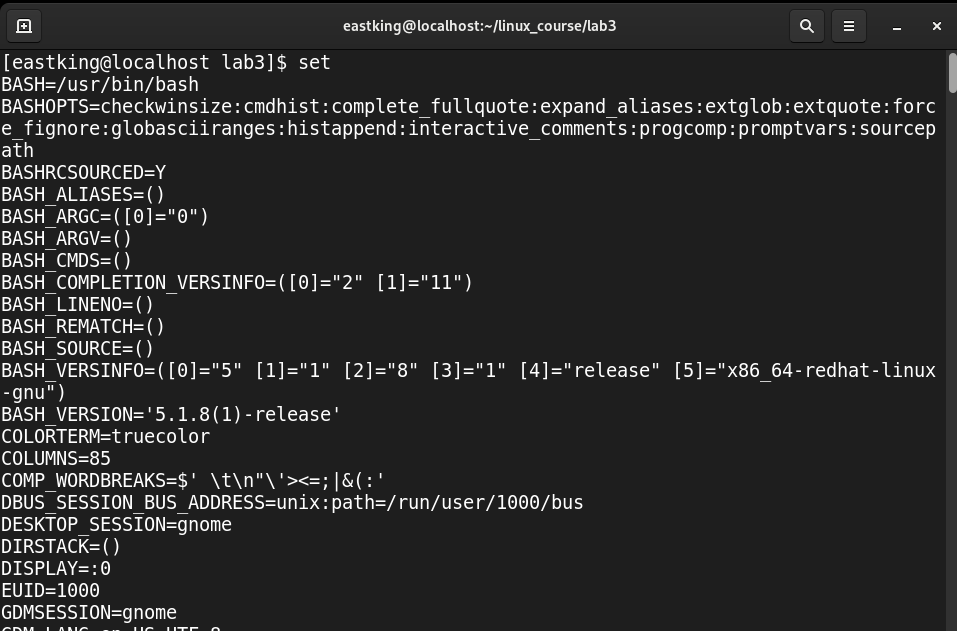

## Q.6: What are the command that lis teh value of a spcific variable?

1. `echo $<variable_name>`

1. `printenv <variable_name>`

1. `printf "%s\n" $<variable_name>`

## Q.7: Display current shell name?

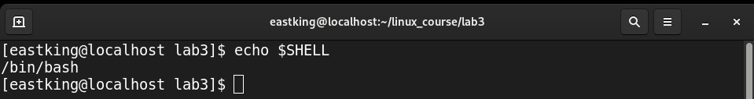

## Q.8: State initialization files for sh, ksh and bash?

1. **sh && bash**

	* `/etc/bashrc` on login && non-login shells
	* `~/.bashrc` on login && non-login shells
	* `/etc/profile` on login shells
	* `~/.bash_profile` on login shells

1. **ksh**

    * `/etc/profile` on login shell
    * `~/.profile` on login shell
    * `~/.kshrc` on login && non-login shell 

## Q.9: Edit your profile to display **date** at login and change your **Prompt** permanently?

1. 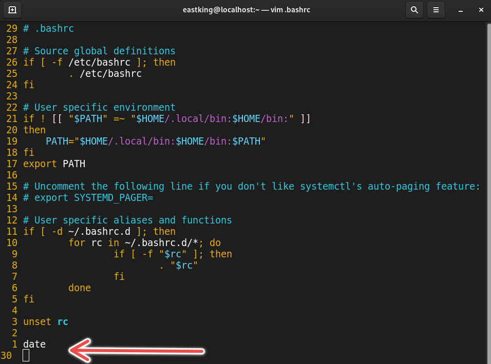

1. 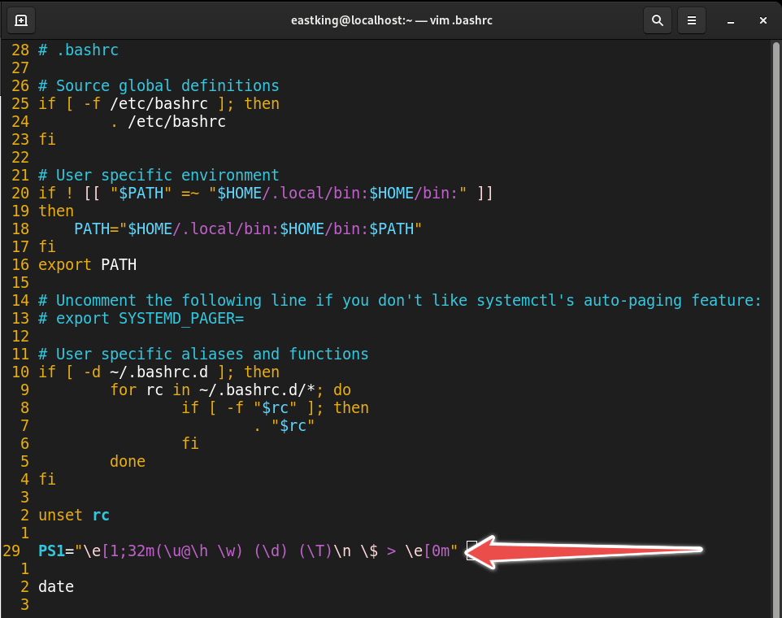

## Q.10: Execute `echo \` ?

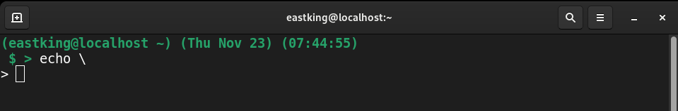

* **What is the purpose of the `\`?**

    If the next character after the backslash is a newline character, then that newline will not be interpreted as the end of the command by the shell. Instead, it effectively allows a command to span multiple lines. It allows you to break a long command into multiple lines for better readability without affecting the actual command execution.

* **Change `>` to `:` ?**

    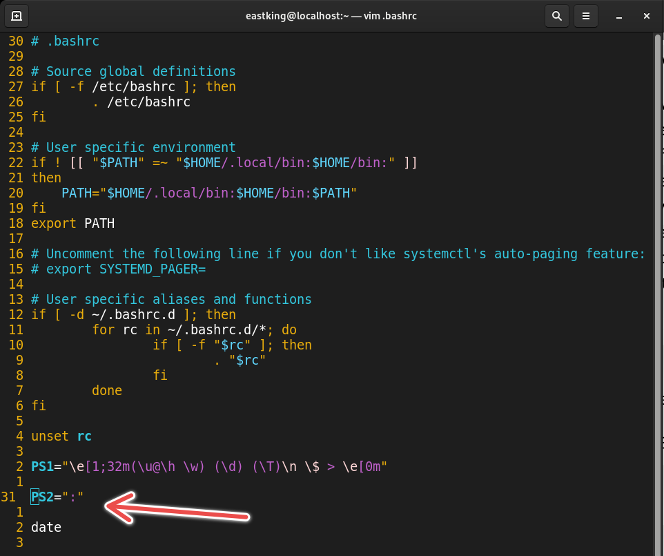
    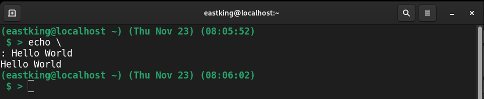

## Q.11: Create Bash shell alias named **ls** for the **ls -l** command?

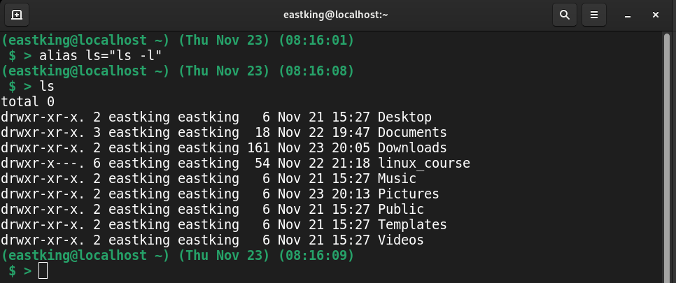
