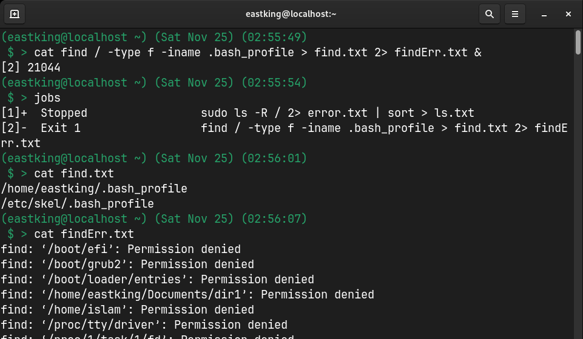

# Lab 4

## Q.1: List the user commands and redirect the output to `/tmp/commands.list`?

## Q.2: Count the number of user commands?

## Q.3: Get all the users names whose first character in their login is `g`?

## Q.4: Get the logins name and full names (comment) of logins starts with `g`?

## Q.5: Save the output of the last command sorted by their full names in a file?

## Q.6: Write the next 2 commands and save their outpu and error in 2 different files and sent the to background?

1. **Search for all files on the system that named `.bash_profile`**

    

1. **Sort the output of `ls` command on `/` recursively?**

    

## Q.7: Display the number of users who is logged not to the system?

## Q.8: Display lines 7 to line 10 of `/etc/passwd` file?

## Q.9: What happens if you execute

1. **`cat filename1 | cat filename2`**

    

    * the output of the first command is discarded and the second command output is printed to the screen

1. **`ls | rm`**

    

    * rm needs arguments to operate and doesnt read from stdout

1. **`ls /etc/passwd | wc -l`**

    

    * 2nd command will print the number of lines results from 1st command whch will be 1 line

## Q.10: Issue the command sleep 100

## Q.11: Stop the last command?

## Q.12: Resume the last command in the background?

## Q.13: Issue the jobs command and see its output?

## Q.14: Send the sleep command to the foreground and send it again to the background?

## Q.15: Kill the sleep command?

## Q.16: Display your processes onle?

## Q.17: Display all processes except yours?

## Q.18: Use the `pgrep` command to list your processes only?

## Q.19: Kill your processes only?

