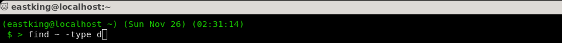

# Lab 5

## Q.1: Compress and decompress a file by `compress`, `gzip` and `zip`?

1. **Compress**

    

1. **gzip**

    

1. **zip**

    

## Q.2: What is the command used to view the content of a compressed file?

1. **`zcat` to view contents of files compressed with `compress`, `gzip` and `zip`**

    

1. **`bzcat` to view contents fo files compressed with `bzip2`**

    

## Q.3: Backup `/etc` director using `tar` utility?

## Q.4: Starting fromyour home directory, find all files that were modified in the last two days?

## Q.5: Starting from `/etc`, find filew owned by `root` user?

## Q.6: Find all directories in your home directory?

## Q.7: Write a command to search for all files on the system that, its name is `.profile`?

1. Using `find` command

    

1. Using `locate` command

    

## Q.8: Identify the file types of the following: `/etc/passwd`, `/dev/pts/0`, `/etc` and `/dev/sda`?

## Q.9: List the `inode` numbers of `/`, `/etc` and `/etc/hosts`?

## Q.10: Copy `/etc/passwd` to your home directory, use the commands `diff` and `cmp` and edit in the file you copied, and then use these commands again, and check the output?

1. **Using `diff`**

    

1. **Using `cmp`**

    

## Q.11: Create a symbolic link of `/etc/passwd` in `/boot`?

## Q.12: Create a hard link of `/etc/passwd` in `/boot`. Could you? Why?

* **Couldn't add a hard link**
* **Why?** because the `/etc/passwd` and `/boot` exists of 2 different partitions and hard links need to exist on the same partition of the file it points to it.
