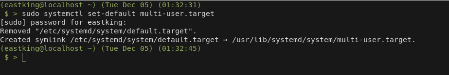
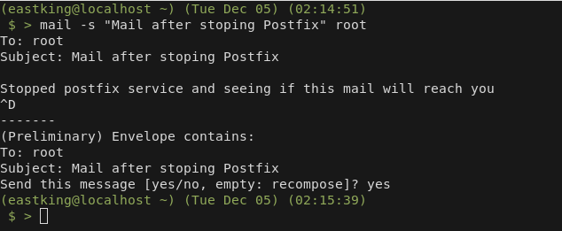

# Lab 6

## Q.1: User `systemctl` to vie the status of all the system services?

## Q.2: Change the default runlevel back to `multi-user.target` and reboot?

## Q.3: Send mail to the root user?

## Q.4: Verify that you have received this mail?

## Q.5: Use `systemctl` utility to stop `postfix` service?

## Q.6: Send mail again to the root user?

## Q.7: Verify that you have received the mail?

## Q.8: Use `systemctl` utility to start `postfix` service?

## Q.9: Verify that you have received the mail?

## Q.10: Edit `Grub2` config file and change the timeout variable equal to 20 seconds?

## Q.11: Edit `Grub2` config file and change your default operating system?

