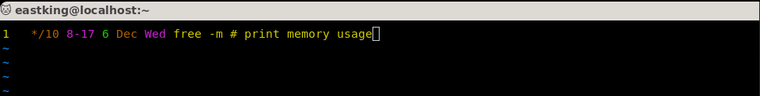

# Lab 6

## Q.1: User `systemctl` to vie the status of all the system services?

## Q.2: Change the default runlevel back to `multi-user.target` and reboot?

## Q.3: Send mail to the root user?

## Q.4: Verify that you have received this mail?

## Q.5: Use `systemctl` utility to stop `postfix` service?

## Q.6: Send mail again to the root user?

## Q.7: Verify that you have received the mail?

## Q.8: Use `systemctl` utility to start `postfix` service?

## Q.9: Verify that you have received the mail?

## Q.10: Edit `Grub2` config file and change the timeout variable equal to 20 seconds?

## Q.11: Edit `Grub2` config file and change your default operating system?

## Q.12: Send memory info every 10 minutes between 8:00 AM and 5:00 PM today?

## Q.13: User mail as root user to check for e-mail from the `cron` jobs you have scheduled?

## Q.14: How could you send the output from these `cron` jobs to another e-mail address?

## Q.15: Use mail as the manager user to check for e-mail fromt the `cron` jobs you have scheduled?

## Q.17: Using `YUM` Attempt to run `gnuplot` command?

## Q.18: Using `YUM` Search for the plotting package?

## Q.19: Using `YUM` Find out more information about the `gnuplot` package?

## Q.20: Using `YUM` Install the `gnuplot` pakcage?

## Q.21: Using `YUM` Attempt to remove `gnuplot-common` package?

## Q.22: Using `RPM` List all installed Packages in your system?

## Q.23: Using `RPM` View the files in the `initscripts` package?

## Q.24: Using `RPM` Get general information about `bash` rpm?

## Q.25: Using `RPM` Have the files from the `pam` package changed since it was installed?

## Q.26: Using `RPM` Which installed package have `gnome` in their name?

