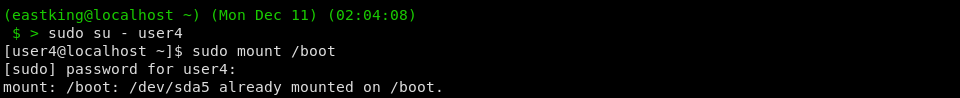

# Lab 7

## Q.1: Add the following users (user1, user2, user3, user4, user5, user6, user7) to the system?

## Q.2: Using `groupadd` add the following groups (`sales gid=10000`, `hr gid=10001`, `web gid=10002`)?

### Why should we set `GID` in this manner instead of allowing the system to set the `GID` by default?

Useful in case where we need to maintain consistency across systems

## Q.3: Using `usermod` add `user1, user2` to sales group, `user3, user4` to hr group, `user5, user6` to web group, and `user7` to all groups?

## Q.4: Login as each user and use `id` command to verify the above question?

## Q.5: Create `/depts/sales/` `/depts/hr/` `/depts/web/`?

## Q.6: Using `chgrp`, setthe group ownership of each directory to the respective group?

## Q.7: Set the permissions on the `/depts` to `755`, and each sub-dir to `770`?

## Q.8: Set the `SGID` on each sub-dir inside `/depts/`?

## Q.9: Switch to `user2` and attempt to create file inside each sub-dir of `/depts`?

### What is the group ownership of the newly created file?

## Q.10: Configure `sudoers` to allow `user3` and `user4` to user `/bin/mount` and `/bin/umount, while allowing`user5` only to user `fdisk` command?

## Q.11: Login as `user3` and try to unmount `/boot`?

## Q.12: Long as `user4` and remount `/boot`?

### Try to view partition table using `fdisk`?

## Q.13: Create dir with permissions `rwxrwx---`, grant second group (sales) `r-x`?

## Q.14: Create a file on the dir and grant `rw` access to second group (sales)?

## Q.15: Set the owning group as the owning group of any newly created file in that dir?

